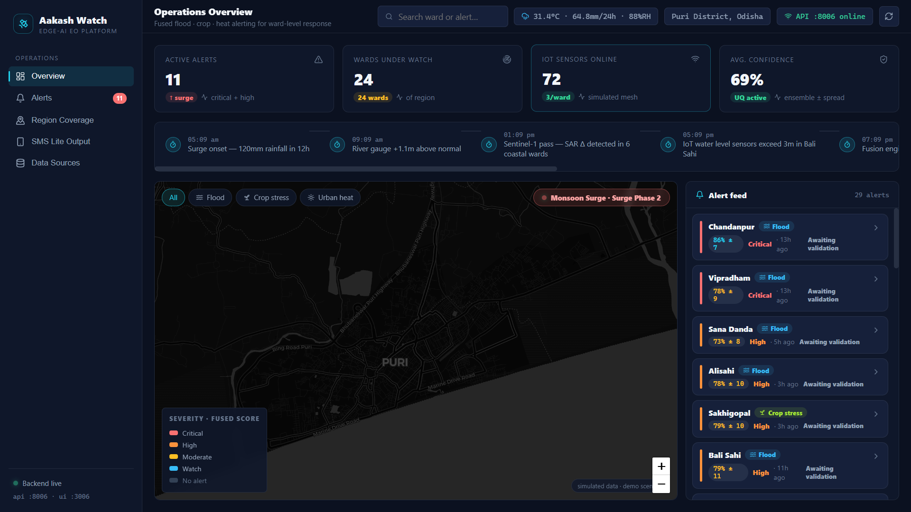
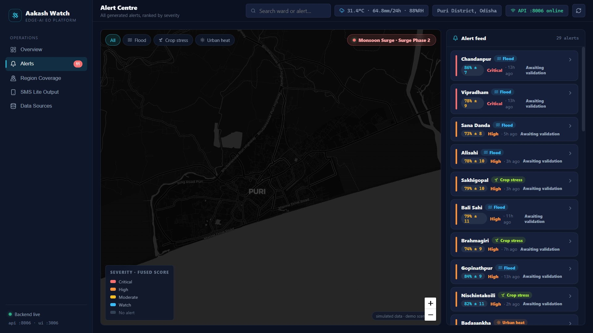
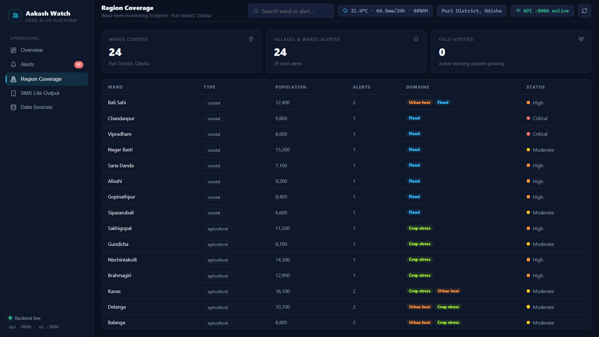
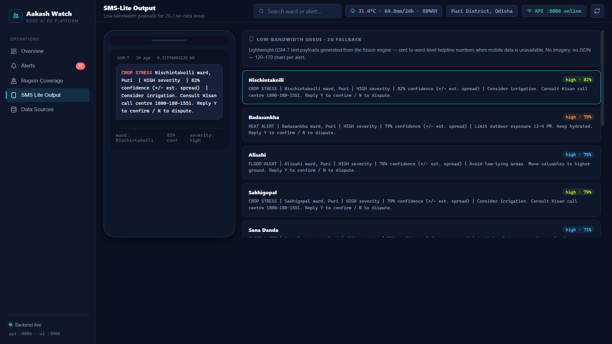
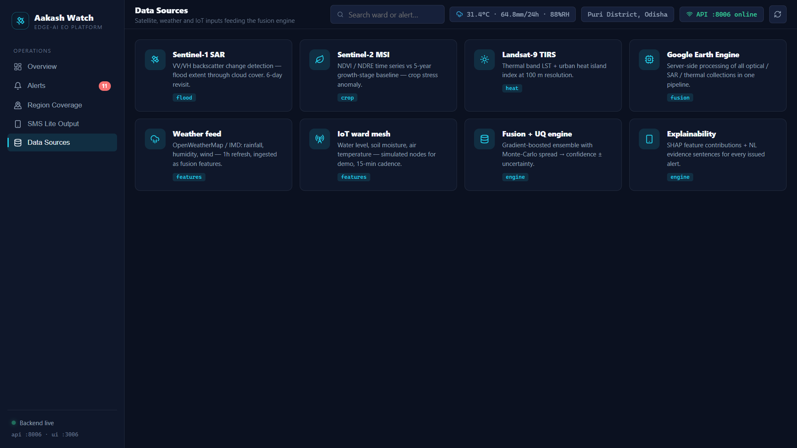

# Aakash Watch — Edge-AI Earth Observation Platform

> **SOA IDEATHON S6** · Hyperlocal flood, crop-stress & urban-heat alerts with uncertainty quantification, evidence explainability, and a human-in-the-loop validation loop.



---

## The Problem

Disasters like monsoon floods, crop failure, and urban heat kill and cost billions every year — yet authorities get alerts that are **late, binary (yes/no), and unexplained**. Field teams in low-bandwidth coastal districts (e.g., Puri, Odisha) can't act on a number they can't trust.

## What We Built

A single "mission-control" dashboard that fuses **satellite (Sentinel-1/2, Landsat-9)**, **weather**, and **simulated IoT** signals into ward-level severity alerts — each with three differentiators:

1. **Uncertainty quantification** — every alert shows `confidence ± uncertainty` (e.g. `78% ± 12%`), not a hard yes/no.
2. **Explainability** — SHAP-style feature-contribution bars (`Rainfall 45% · SAR Δ 35% · IoT water level 20%`) plus a natural-language evidence sentence, so alerts are auditable and trustworthy.
3. **Human-in-the-loop validation** — authorities **Confirm / Mark False Positive / Partially Correct** from the dashboard; feedback feeds the retraining loop.

Plus a **low-bandwidth SMS-lite payload** (2G-safe) proving the edge-deployment story:

```
FLOOD ALERT: Ward 12, HIGH severity (82% confidence).
Avoid low-lying areas. Reply Y to confirm / N to dispute.
```

## Working Demo









---

## Tech Stack

| Layer | Tool |
|---|---|
| Frontend | Vite + React 19, Leaflet.js (dark CARTO tiles), lucide-react, hand-rolled SVG charts |
| Backend | FastAPI (port **8006**), Pydantic |
| Data | Deterministic seeded scenario — Puri district, Odisha (monsoon surge) — **no API keys or internet needed** |
| UI | UI on port **3006**, Vite dev proxy `/api` → `localhost:8006` |

## Project Structure

```
SOAIDEATHON-S6/
├── assets/          # Demo screenshots
├── backend/
│   ├── main.py      # FastAPI app — all endpoints
│   ├── data.py      # Seeded ward/alert/sensor data store
│   └── requirements.txt
├── frontend/
│   ├── src/         # React app (dashboard, map, drawer, SMS view)
│   └── package.json # vite / react / leaflet
├── plan.md          # Full hackathon plan (pipeline & models)
├── design.md        # UI/UX design spec (tokens, IA, components)
└── start.ps1        # One-command start/stop/status helper
```

---

## Run Instructions

### Prerequisites

- **Python 3.10+** (backend venv is at `backend/.venv`)
- **Node.js 18+** (frontend deps already in `frontend/node_modules`)

### Quick start (Windows)

```powershell
.\start.ps1            # start backend (:8006) + frontend (:3006)
.\start.ps1 -Status    # check if servers are up + health
.\start.ps1 -Stop      # stop both servers
```

Then open **http://localhost:3006**

> The start script kills any stale process on ports 8006/3006 first, launches both servers hidden, and waits for them to come up. Logs go to `logs\backend.log` / `logs\ui.log`.

### Manual start (any OS)

**Backend**

```bash
cd backend
python -m venv .venv               # first time only
.venv\Scripts\activate             # Windows   (source .venv/bin/activate on macOS/Linux)
pip install -r requirements.txt    # first time only
uvicorn main:app --host 0.0.0.0 --port 8006
```

**Frontend** (second terminal)

```bash
cd frontend
npm install        # first time only
npm run dev -- --port 3006 --strictPort
```

### Verify

- UI → http://localhost:3006
- API → http://localhost:8006/api/health → `{"status": "ok", ...}`
- Docs → http://localhost:8006/docs (Swagger UI)

---

## API Endpoints

| Method | Endpoint | Description |
|---|---|---|
| GET | `/api/health` | Service status + region |
| GET | `/api/dashboard` | Summary stats (alerts, wards, sensors, confidence) |
| GET | `/api/wards` | Ward polygons as GeoJSON |
| GET | `/api/alerts` | Alert list (optional `?domain=` / `?severity=` filters) |
| GET | `/api/alerts/{id}` | Full alert: evidence, explanation, sensors, SMS payload |
| POST | `/api/alerts/{id}/validate` | `{action: confirmed\|false_positive\|partial, comment?}` |
| GET | `/api/alerts/{id}/sms` | SMS-lite payload + byte size |
| GET | `/api/timeline` | Monsoon surge event timeline |

---

## Demo Script (2–3 min)

1. **Overview** — map of Puri district, 4 stat cards, live alert feed.
2. **Click a ward** → detail drawer: severity, `confidence ± uncertainty` band, evidence contribution bars, NL explanation, simulated IoT sensor strip.
3. **Validate** → Confirm a flood alert → toast + status chip + stat cards update (human-in-the-loop).
4. **SMS Lite screen** → phone-style low-bandwidth payload (2G story).
5. **Data Sources** → Sentinel-1/2, Landsat-9, GEE, weather, IoT — free/simulated data story.

## Notes

- All data is **deterministic and simulated** — the demo is repeatable offline; no API keys required.
- `plan.md` documents the full production roadmap (GEE pipelines, U-Net flood masks, conformal prediction with MAPIE, TFLite/ONNX edge deployment) that this MVP demo stands on.
- Backup tip: keep this GitHub README's screenshots ready as a fallback if the live demo or network fails during judging.